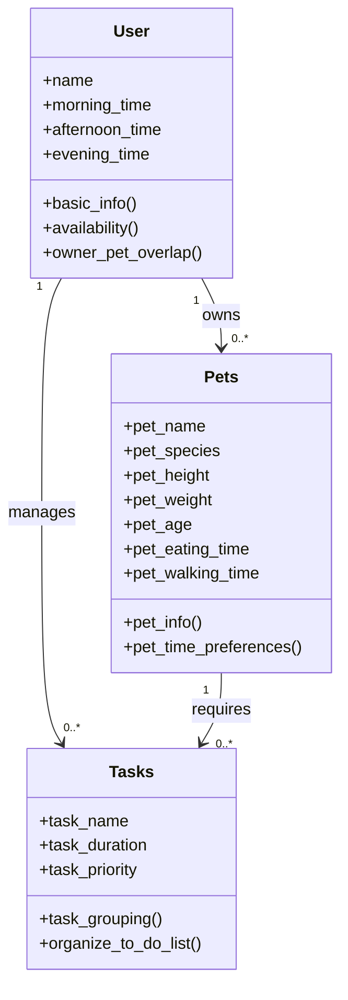

# PawPal+ Project Reflection

## 1. System Design

**a. Initial design**

- Briefly describe your initial UML design.

    1) Let's user enter user + pet info: 
        + User info: 
            = Ask user to input user name. Save it in a variable 
            = Ask user to input number of pets. 
        + Pet info: 
            = Ask to input pet name. Save it in a variable 
            = Ask user about species 
            = Store eating time 
            = Store walking time
    
    2) Let user add or edit tasks 
        + User inputs a tuple/dict with info regarding task name, duration, and priority 
        + Ability to edit this list before and after outputting. 
    
    3) App generates to-do list of task 
        + 1 or 2 functions can be used to sort tasks within a list based on duration and time, outputting a final list of tasks that user can follow in order with the ability to edit this to-do list as well. 

    Overall, the goal of this app is to maintain both user and pet info using two separate classes, User and Pets, while also allowing users to input information regarding their tasks. The app will then organize tasks based on duration and time (using the class Task). The class User takes in the name of the user and the number of pets they own. Using the class Pets, users can input information regarding their pet's name, the species of the pet, their usual eating time, and usual walking time. The class Task will take in tasks and output a schedule for the User. 

- What classes did you include, and what responsibilities did you assign to each?

    1) class User 
        = self.name 
        = self.morning_time 
        = self.afternoon_time 
        = self.evening_time

        + Method: def basic_info 
        + Method: def availability
        + Method: def owner_pet_overlap
    
    2) class Pets
        = self.pet_name 
        = self.pet_species 
        = self.pet_height 
        = self.pet_weight 
        = self.pet_age 
        = self.pet_eating_time 
        = self.pet_walking_time

        + Method: def pet_info 
        + Method: def pet_time preferences 
    
    3) class Tasks 
        = self.task_name 
        = self.task_duration 
        = self.task_priority
    
        + Method: def task_grouping 
        + Method: def_organize_to_do_list

**b. Design changes**

- Did your design change during implementation?
- If yes, describe at least one change and why you made it.

---

## 2. Scheduling Logic and Tradeoffs

**a. Constraints and priorities**

- What constraints does your scheduler consider (for example: time, priority, preferences)?
- How did you decide which constraints mattered most?

**b. Tradeoffs**

- Describe one tradeoff your scheduler makes.
- Why is that tradeoff reasonable for this scenario?

---

## 3. AI Collaboration

**a. How you used AI**

- How did you use AI tools during this project (for example: design brainstorming, debugging, refactoring)?
- What kinds of prompts or questions were most helpful?

**b. Judgment and verification**

- Describe one moment where you did not accept an AI suggestion as-is.
- How did you evaluate or verify what the AI suggested?

---

## 4. Testing and Verification

**a. What you tested**

- What behaviors did you test?
- Why were these tests important?

**b. Confidence**

- How confident are you that your scheduler works correctly?
- What edge cases would you test next if you had more time?

---

## 5. Reflection

**a. What went well**

- What part of this project are you most satisfied with?

**b. What you would improve**

- If you had another iteration, what would you improve or redesign?

**c. Key takeaway**

- What is one important thing you learned about designing systems or working with AI on this project?
