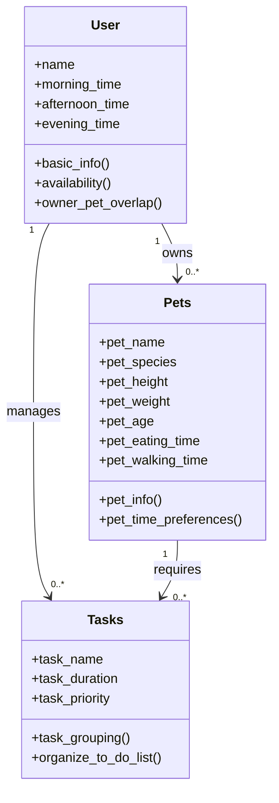

# PawPal+ Project Reflection

## 1. System Design

**a. Initial design**

- Briefly describe your initial UML design.

    1) Let's user enter user + pet info: 
        + User info: 
            = Ask user to input user name. Save it in a variable 
            = Ask user to input number of pets. 
        + Pet info: 
            = Ask to input pet name. Save it in a variable 
            = Ask user about species 
            = Store eating time 
            = Store walking time
    
    2) Let user add or edit tasks 
        + User inputs a tuple/dict with info regarding task name, duration, and priority 
        + Ability to edit this list before and after outputting. 
    
    3) App generates to-do list of task 
        + 1 or 2 functions can be used to sort tasks within a list based on duration and time, outputting a final list of tasks that user can follow in order with the ability to edit this to-do list as well. 

    Overall, the goal of this app is to maintain both user and pet info using two separate classes, User and Pets, while also allowing users to input information regarding their tasks. The app will then organize tasks based on duration and time (using the class Task). The class User takes in the name of the user and the number of pets they own. Using the class Pets, users can input information regarding their pet's name, the species of the pet, their usual eating time, and usual walking time. The class Task will take in tasks and output a schedule for the User. 

- What classes did you include, and what responsibilities did you assign to each?

    1) class User 
        = self.name 
        = self.availability 
        = self.pets

        + Method: def basic_info 
        + Method: def owner_pets
        + Method: def add_pets 
        + Method: def available_times
    
    2) class Pets
        = self.pet_name 
        = self.pet_species 
        = self.tasks

        + Method: def pet_info 
        + Method: def add_task
    
    3) class Tasks 
        = self.task_name 
        = self.task_duration 
        = self.task_time
        = self.task_priority
    
        + Method: organize_tasks
    
    4) class Scheduler 
        = self.user 
        = self.pets 
        = self.tasks

    Claude was able to identify logic errors that would likely interfere with the skeleton of each class over the course of building the classes. For example, Claude recommend that I include an additional class called Scheduler, separate from task, that would output a full schedule of tasks that a user can follow based on time, duration, and priority. Instead of outputting a schedule through tasks, Scheduler can make the process of finalizing the schedule separate from grouping individual tasks with their name, time, duration and priority. Claude also recommended that I make the instances self.availability and self.pets as lists, so these instances can be accessible outside the User class (helps connect User with class Pets and Tasks). Same goes for Pets, where the instance self.task can be accessed by the class Tasks. 

**b. Design changes**

- Did your design change during implementation?
    Yes, to some degree. I made changes to the method create_schedule() in the class Scheduler 

- If yes, describe at least one change and why you made it
    The introduction of a "Guard Clause" in Scheduler.create_schedule(). Previously, I included an if-else statement where the method will raise an error after it detects the right attributes needed to continue through the method (sef.pets and self.tasks). However, Claude recommended that I include a ValueError statement before it detects the right attributes, further simplifying readability and flow of the method. 

---

## 2. Scheduling Logic and Tradeoffs

**a. Constraints and priorities**

- What constraints does your scheduler consider (for example: time, priority, preferences)?
    + The scheduler considered constraints such as priority, frequency, and to some degree, time, however, time is an optional attribute to include. Time can be automatically included if no time slot is given. One attribute that also exists is duration, however, tihs attribute is less relevant than the other attributes described. 

- How did you decide which constraints mattered most?
    + Based on which constraints will be the most convenient for the ower, such as priority. Tasks that also happen more often are also constraints that matter the most. 

**b. Tradeoffs**

- Describe one tradeoff your scheduler makes: 
    + One major tradeoff: Time slots 
- Why is that tradeoff reasonable for this scenario?
    + Instead of specific times and duration, including simplified time slots allowed for more schedule flexibility and organization. 

---

## 3. AI Collaboration

**a. How you used AI**

- How did you use AI tools during this project (for example: design brainstorming, debugging, refactoring)?
    + AI helped with not only building test cases for main.py and pawpal_system.py, AI has been helpful with explaining code, reviewing and editing the skeleton, and giving recommendation on simplifying code. 

- What kinds of prompts or questions were most helpful?
    + "How can I made this method readable and simple while also maintaining the function?" 
    + "What are some logical errors you can identify from these updated codes" 

**b. Judgment and verification**

- Describe one moment where you did not accept an AI suggestion as-is.
    + An AI asked me to include an entirely new method that specifically looks up tasks, however, I believed this task can be performed within organize_schedule() and felt as if this suggestion over-complicated the method. 

- How did you evaluate or verify what the AI suggested?
    I read through the code and compared it to what the previous lines of code were. I also looked into specific variables used for both versions and chose the version that reused accessible variables without over complicating the readability of the code. 

---

## 4. Testing and Verification

**a. What you tested**

- What behaviors did you test?
    + I tested the code's ability to respond to different types of task attributes, assign tasks to specific pets, and organize tasks based on priority, time slots (if given), and whether the task has been completed. The program especially tests for completion, proper filtering, and re-appending if frequency is daily. 

- Why were these tests important?
    + These tests were important to ensure that the program is able to respond to classes with diverse attributes that don't line up with other class objects. 

**b. Confidence**

- How confident are you that your scheduler works correctly?
    + I am 70 to 80% confident this scheduler would work. 

- What edge cases would you test next if you had more time?
    + I would want to spend more time testing the program's ability to properly sort time not just by three values "morning", "afternoon", and "night", but by specific times of the day. 
---

## 5. Reflection

**a. What went well**

- What part of this project are you most satisfied with? 
    + I am the most proud of the four classes made and the structure of those classes. 

**b. What you would improve**

- If you had another iteration, what would you improve or redesign?
    + I would redesign frequency detection and include features where the program can also respond to weekly tasks without focusing on re-appending daily tasks only. I want to create a system that allows for weekly data to be stored and re-appended after a certain number of days. 

**c. Key takeaway**

- What is one important thing you learned about designing systems or working with AI on this project?
    + You cannot overly rely on AI, but rely on your own intuition before using AI to double check or look for improvements towards your own inferences aout how to approach a problem. 
